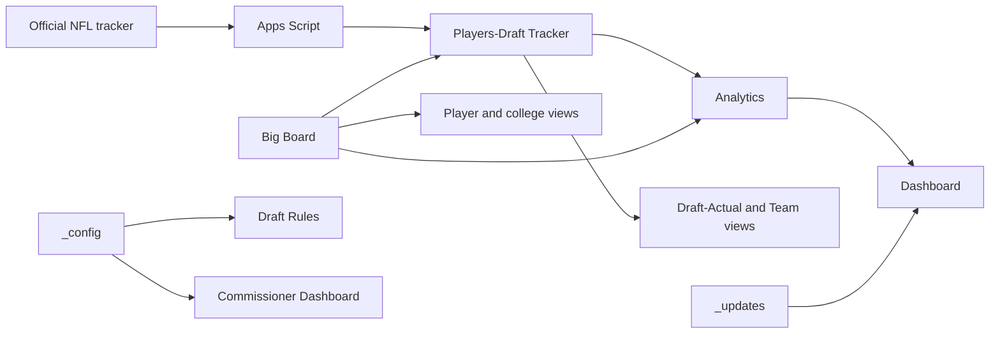
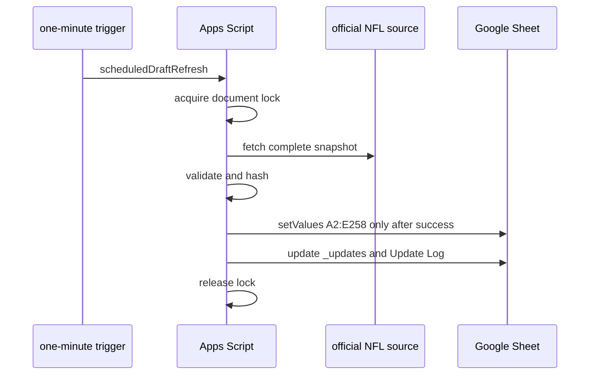

# diagrams

## workbook-dependencies

```mermaid
flowchart LR
  NFL[Official NFL tracker] --> Script[Apps Script]
  Script --> Tracker[Players-Draft Tracker]
  Board[Big Board] --> Tracker
  Tracker --> Analytics
  Board --> Analytics
  Tracker --> TeamViews[Draft-Actual and Team views]
  Board --> PlayerViews[Player and college views]
  Analytics --> Dashboard
  Config[_config] --> Rules[Draft Rules]
  Config --> Commissioner[Commissioner Dashboard]
  Updates[_updates] --> Dashboard
```

## live-refresh-sequence

```mermaid
sequenceDiagram
  participant Trigger as one-minute trigger
  participant Script as Apps Script
  participant NFL as official NFL source
  participant Sheet as Google Sheet
  Trigger->>Script: scheduledDraftRefresh
  Script->>Script: acquire document lock
  Script->>NFL: fetch complete snapshot
  Script->>Script: validate and hash
  Script->>Sheet: setValues A2:E258 only after success
  Script->>Sheet: update _updates and Update Log
  Script->>Script: release lock
```
