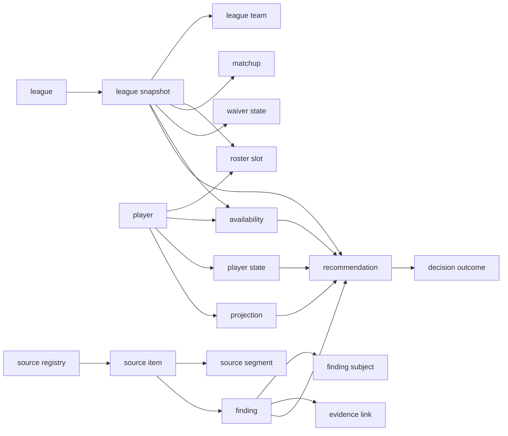

# league-intelligence-metadata-schema

## purpose

This schema makes a recommendation reproducible. Every recommendation must identify the league state used, player facts used, editorial claims considered, conflicts found, and the exact time each record was observed. It supports answers such as "who should I start", "what waiver claim should I make", and "how does another manager's lineup change my decision" without treating generic content as league-specific evidence.

## source-registry

| Field | Meaning | Required |
|---|---|---|
| `source_id` | Stable lower-kebab identifier, for example `fantasy-football-today` | Yes |
| `publisher` | Publisher or creator name | Yes |
| `source_kind` | `podcast`, `article`, `provider-api`, or `league-api` | Yes |
| `home_url` | Canonical publisher page | Yes |
| `feed_url` | RSS or other publisher-supported discovery URL | No |
| `rights_policy` | Allowed stored material and retention rule | Yes |
| `league_relevance` | `direct`, `player-context`, or `excluded-generic` | Yes |
| `freshness_policy_version` | Version of the source and data-type time-to-live policy | Yes |
| `active` | Whether the source is eligible for ingestion | Yes |

The initial registry contains the following entries. Both podcast feeds returned HTTP 200 with an RSS or XML content type on 2026-08-30. ESPN editorial sources are not registry entries because they are excluded from generic recommendation evidence.

| source_id | home_url | feed_url | permitted initial use |
|---|---|---|---|
| `fantasy-football-today` | `https://www.cbssports.com/podcasts/fantasy-football-today-podcast/` | `https://rss.amperwave.net/v2/feed/audacynetwork/38ad78ba12adc2acec34b47b1a455b85` | Episode discovery, metadata, publisher descriptions, and user-controlled transcript-worker input |
| `fantasy-footballers` | `https://www.thefantasyfootballers.com/` | `https://feeds.simplecast.com/sw7PGWfw` | Episode discovery, metadata, publisher descriptions, and user-controlled transcript-worker input |
| `fantasypros-public-v2` | `https://api.fantasypros.com/public/v2/docs` | | Player facts, rankings, projections, news, injuries, and historical points |
| `espn-league` | `https://fantasy.espn.com/` | | Direct user league state only, when authorized |

## canonical-entities

| Entity | Primary key | Required fields | Purpose |
|---|---|---|---|
| `league` | `league_id` | platform, sport, season, timezone, scoring profile, roster profile, visibility | One user league and its rules |
| `league_snapshot` | `league_snapshot_id` | league_id, observed_at, scoring_period, matchup_period, source_version, freshness_status | Immutable view of league state at a point in time |
| `league_team` | `league_team_id` | league_id, platform_team_id, display_name, manager_name | One manager team, including the user and the other 11 teams |
| `league_membership` | `league_membership_id` | league_id, connected_account_ref, league_team_id, effective_from, effective_to, is_connected_user | Season-aware mapping from the connected account to the user's team |
| `roster_slot` | `roster_slot_id` | league_snapshot_id, league_team_id, slot, player_key, lineup_status, locked_at | Current starter, bench, IR, or reserve placement |
| `matchup` | `matchup_id` | league_snapshot_id, period, home_team_id, away_team_id, score, projected_score | Current or historical head-to-head state |
| `waiver_state` | `waiver_state_id` | league_snapshot_id, league_team_id, system, priority_value, budget_remaining, processing_at | Current team-level waiver priority or budget context |
| `transaction` | `transaction_id` | league_snapshot_id, transaction_type, status, created_at, team_id, player_key | Waiver, free-agent, trade, or lineup transaction history |
| `availability` | `availability_id` | league_snapshot_id, player_key, availability_state, waiver_state, eligible_slots | Whether a player can be added or claimed in this league |
| `player` | `player_key` | canonical_name, sport, primary_position | Canonical player identity |
| `player_identifier` | `player_identifier_id` | player_key, provider, external_id, active_from, active_to | FantasyPros, ESPN, and source-specific identity joins |
| `player_state` | `player_state_id` | player_key, observed_at, health_status, team, position, source_id | Time-stamped factual player state |
| `projection` | `projection_id` | player_key, observed_at, scoring_profile, horizon, value, source_id | Projection or ranking fact from a provider |
| `source_item` | `source_item_id` | source_id, canonical_url, published_at, title, item_kind, metadata_hash, metadata_hash_algorithm, retrieved_at | One podcast episode or article |
| `audio_artifact` | `audio_artifact_id` | source_item_id, enclosure_url, audio_content_hash, audio_hash_algorithm, retrieved_at, storage_ref | One retrieved audio enclosure for an audio-bearing source item |
| `transcript_artifact` | `transcript_artifact_id` | source_item_id, audio_artifact_id, storage_ref, transcript_content_hash, transcript_hash_algorithm, format, duration_seconds, model_version, processed_at, retention_until | A full transcript held only on the user-controlled local machine or VPS |
| `source_segment` | `source_segment_id` | source_item_id, transcript_artifact_id, offset_start, offset_end, text_ref, rights_status | A publisher-provided note or authorized transcript segment |
| `extraction_run` | `extraction_run_id` | transcript_artifact_id, pipeline_version, started_at, completed_at, status, input_hash | Reproducible extraction of claims from a specific transcript artifact |
| `finding` | `finding_id` | source_item_id, extraction_run_id when transcript-derived, finding_type, summary, published_at, confidence, review_status | Attributed structured observation extracted from a source item |
| `finding_subject` | `finding_subject_id` | finding_id, subject_type, subject_key, relation | Player, team, matchup, or strategy target of a finding |
| `evidence_link` | `evidence_link_id` | target_type, target_id, source_item_id, segment_id, quote_or_summary, locator | Traceable source citation for a finding or recommendation |
| `recommendation` | `recommendation_id` | league_snapshot_id, recommendation_type, subject_player_key, action, rationale, confidence, status | A league-specific proposed start, sit, waiver, hold, trade, or monitor action |
| `recommendation_input` | `recommendation_input_id` | recommendation_id, input_type, input_id, freshness_policy_id when time-sensitive, weight, role | The facts, findings, and constraints used to create a recommendation |
| `decision_outcome` | `decision_outcome_id` | recommendation_id, decision, decided_at, outcome_at, outcome_metric | Audit record of what was done and what happened |
| `freshness_policy` | `freshness_policy_id` | source_id, data_type, policy_version, ttl_seconds, effective_from, effective_to | Versioned rule for calculating whether a record is current |

## relationships

## freshness-and-safety-rules

- A lineup recommendation requires a current `league_snapshot`, the user's relevant `roster_slot` records, the opponent's projected or started `roster_slot` records, current scoring rules, and player states observed after the most recent relevant injury or news update.
- A waiver recommendation requires a current `availability` record, the user's roster and positional constraints, waiver rules, current priority or budget, and the most recent transaction snapshot.
- An opponent-specific recommendation may use only roster, lineup, matchup, waiver, and transaction data from the connected league. It must not use generic ESPN editorial content.
- `stale` is a computed state, not an erased record. A record becomes stale when its source-specific refresh interval has elapsed or its scoring period has changed.
- A player match with more than one plausible canonical player remains `unresolved` and cannot enter a recommendation.
- A recommendation with conflicting findings must retain each finding and state the conflict. It cannot collapse disagreement into a fabricated consensus.
- No claim may be represented as a provider fact unless it comes from a provider API record. Podcast and article analysis remain source opinions with attribution.
- A recommendation records the `freshness_policy_id` applied to every time-sensitive input. It is invalid when any required input has exceeded that policy's `ttl_seconds`.

## transcript-relations

Each source item may have zero or more audio artifacts, so articles require no audio fields. Each audio hash identifies one retrieved enclosure and each transcript hash identifies one produced artifact. Each transcript artifact belongs to exactly one source item and one audio artifact, remains outside this repository, and may have multiple extraction runs. Each transcript-derived finding must identify its extraction run. Each transcript-backed source segment must identify both its source item and its transcript artifact, plus start and end offsets in seconds. Each league membership maps the connected user account to exactly one active league team for its effective period. Each waiver-state record belongs to one team so competing priorities and budgets remain distinguishable.

## finding-taxonomy

| Finding type | Required subject | Example use |
|---|---|---|
| `start-sit` | player | Editorial start or sit reasoning |
| `waiver-target` | player | Claim priority or FAAB rationale |
| `trade-value` | player or team | Buy, sell, or hold reasoning |
| `injury-impact` | player | Availability or workload change |
| `role-change` | player | Snap, target, carry, or depth-chart implication |
| `matchup-impact` | player or matchup | Opponent or game-environment reasoning |
| `schedule-impact` | player or team | Multi-week schedule reasoning |
| `league-rule-impact` | league | Scoring or roster-rule implication |

## recommendation-contract

Each `recommendation` must include the following fields before it is shown to the user: action, player or team subject, league snapshot timestamp, scoring period, confidence, upside and downside, explicit invalidation condition, source evidence links, and a statement of whether the recommendation is lineup, waiver, trade, or monitor. A recommendation never executes an ESPN mutation. The user remains the decision maker.

## question-routing

| Question | Required entities |
|---|---|
| Who should I start this week? | league_snapshot, roster_slot, matchup, player_state, projection, finding, recommendation |
| How does the other manager's current lineup change my start-sit choice? | league_snapshot, both teams' roster_slot records, matchup, player_state, projection, recommendation |
| Which waiver claim helps my team most? | availability, waiver_state, roster_slot, league rules, player_state, projection, finding, recommendation |
| What FAAB or priority cost is justified? | waiver_state, availability, roster needs, finding, historical outcome where available |
| What changed since the last refresh? | two league_snapshot records, transaction, player_state, source_item, finding |
| Why was this recommendation made? | recommendation_input, evidence_link, league_snapshot, finding, projection, player_state |
| Was the recommendation useful? | recommendation, decision_outcome, matchup, later player_state or scoring record |

## retention-and-rights

Store source URLs, publication metadata, source descriptions, content hashes, short permitted excerpts, timestamps, and derived findings in the workbook. Store audio and full transcripts only in the user-controlled local machine or VPS referenced by `storage_ref`; do not place them in Apps Script, Google Sheets, Git, logs, or test fixtures. Keep secrets only in the runtime secret store or Apps Script Script Properties and never copy them into this schema, a sheet, log, test fixture, or commit.

## transcript-worker-contract

The local or VPS worker discovers an episode through the source feed, records its source-item metadata, downloads the publisher's audio enclosure subject to the publisher's terms, and generates a transcript artifact outside this repository. It emits a JSON import record containing `source_item_id`, `audio_artifact_id`, audio content hash and algorithm, transcript content hash and algorithm, retrieval timestamp, model version, duration, language, timestamped segment offsets, speaker labels when available, extraction-run identifier, extracted findings, player candidates, and short evidence excerpts. The importer rejects a record when its source item, audio artifact, hashes, time offsets, extraction lineage, or player identities cannot be validated. It stores the full transcript only at `storage_ref` and keeps the workbook record limited to metadata, permitted excerpts, and findings.

The worker may use a local transcription model or a VPS model service, but it must identify the model and pipeline version in every `transcript_artifact` and `extraction_run`. Reprocessing creates a new extraction run rather than replacing the previous record, so a changed model or prompt can be compared and rolled back. Full-text search and retrieval run against the worker's transcript store; the workbook receives only the evidence necessary to justify a specific fantasy recommendation.
